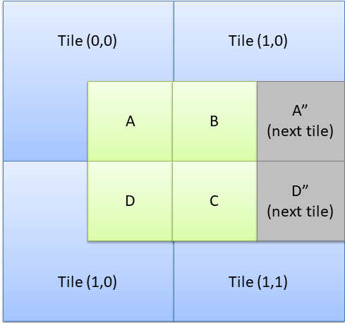

## Tile Matchers and Tile Registries

A tile matcher is a class that takes a map coordinate as
input and that produces a sequence of tiles for rendering
to represent the data at the given map position.

There are multiple strategies on how the map data can be
transformed into rendering information.

Most of the tile matchers implemented in this library make
the reasonable assumption that rendering objects are identified
by a name (the graphics tag). Using a text based tagging 
system allows us to move tile data definitions into external
JSON or XML files and also allows us to create rich tags
that contain some context information.

### Direct Matching

Use the direct matchers if there is a one to one relationship 
between map data and actual rendering representation.

1. BitVectorMatcher

   The BitVectorMatcher assumes that the input data is a 
   integer value that is interpreted as a set of flags.
   The matcher will compute the active bits and will query
   a lookup function with the index of those bits to return
   the actual rendering object.

2. DirectMappingTileMatcher

   This matcher uses a two-step translation process to 
   (a) read the map to produce a data object and (b) to
   translate the data object to a render object and context
   object.

       int[,] map;

       bool Matcher(int mapElement, out TRenderTile rendering, out TContext context)
       {
          // your logic here
          if (mapElement != -1)
          {
            var gameRule = rules.TerrainRules[terrainId];
            var tag = gameRule.GraphicTag;
            rendering = tileRegistry.Lookup(tag);
            context = default(TContext);
          }
          
          // otherwise decline the match
          rendering = default(TRenderTile);
          context = default(TContext);
          return false;
       }

       var matcher = new DirectMappingTileMatcher<int, TRenderTile, TContext>((x,y) => map[x,y], Matcher)

3.  BasicTileSelector

    This class performs a similar function as the DirectMapping 
    tile matcher but assumes that there is a string based graphic
    tag that identifies the rendering data. 

    All selectors in the Steropes.Tiles.Matcher.Sprites package
    are designed to be easily composable. They are not meant to
    handle all tasks in a single instance.
    
    The basic tile selector is meant to work in conjunction with
    other tile selectors and is rarely useful alone. A single 
    selector checks the map data for a single rendering type. 
    The matching relies on a boolean expression to tell whether a 
    given map element can be rendered or not.

### Context Aware Matching

1. Cardinal Tile Selector

   This selector chooses tiles based on a predicate function
   that tests the 4 neighbouring cells along the edges. You
   can use this to create a seamless connection between some
   tile types (i.e. match up mountains with hills and other 
   mountains).

                (north)

       (west)   (cell)   (east)

               (south)

   The selector will evaluate all four neighbours and will 
   translate the result into a combined graphic tag in
   the format ``{prefix}{baseTag}_n?e?s?w?``. 
   
   Therefore if the condition detects matches in the north
   and eastern neighbours, it will generate the tag
   ``{prefix}{basetag}_n1e1s0w0``.

   There are 2^4 (=16) different possible tile combinations.

2. Diagonal Tile selector

   This connector is similar to the cardinal selector, but
   this time it matches neighbours at the corner positions.

       (northwest)      (northeast)

                  (cell)   

       (southwest)      (southeast)

   The resulting pattern is given in the format 
   ``{prefix}{basetag}_nw{0}ne{1}se{2}sw{3}``.

   There are 2^4 (=16) different possible tile combinations.

3. Corner Tile Selector

   A corner tile selector divides a normal tile into 4 sub tiles,
   and matches each sub-tile against its 3 neighbour cells.

                  
                +-----------+-----------+
                |           |           |
                |   up      |   right   |
                |           |           |
                |           |           |
                +-----------+-----------+
                |           |           |
                |   left    |   down    |
                |           |           |
                |           |           |
                +-----------+-----------+

   For example the match for the ``up`` corner for a map coordinate
   of (1,1) would match against the following cells.

                +-----------+-----------+
                |   north   |           |
                |   west    |   north   |
                |   (0,0)   |   (1,0)   |
                |           |           |
                +-----------+-----------+
                |           |           |
                |   west    |   up      |
                |   (0,1)   |   (1,1)   |
                |           |           |
                +-----------+-----------+
   
   The matcher uses a boolean match to select corner tiles. If you
   need to match against multiple conditions, use the CellMap selector
   instead.

   The selector produces 4 renderings based on each sub tile and
   its neighbouring cells.
    
   1. ``{tag}_u???``
   2. ``{tag}_r???``
   3. ``{tag}_d???``
   4. ``{tag}_l???``

   where ? will be replaced with the computed matcher result for
   each neighbouring cell in clockwise direction (n, ne, e, se 
   and so on).

   Therefore with the default settings, and assuming there is a
   match for the north and east tiles, this will produce the 
   following rendering

   1. ``{tag}_u001`` - west = 0, northwest = 0, north = 1
   2. ``{tag}_r101`` - north = 1, northeast = 0, east = 1
   3. ``{tag}_d100`` - east = 1, southeast = 0, south = 0
   4. ``{tag}_l000`` - south = 0, southwest = 0, west = 0

   The corner selector requires 4 * 2^3 (=32) tiles for each
   possible combination. When rendering, each cell will be
   rendered at a slightly different position. Renderer can
   use the SpritePosition parameter to detect the correct
   logical position to adjust the rendering offset.

4. Cell Map Tile Selector

   The cell map selector is conceptually similar to the corner
   selector, but due to the larger number of possible matches,
   this selector combines cell matches into larger cells.

   As with the corner selector, tiles are split into 4 sub tiles.
   Each corner tile is matched against each of its 3 neighbours.
   
   The result tile graphics are provided as a combination of
   the four matched corners. Each of these combined cells is
   rendered so that it overlaps the 4 corner segments at one
   of the origin tile corners.

   

   A cell map will render a single tile for the area covered 
   by the sub-tiles A, B, C and D. To select the tile, the 
   cell map selector uses a matcher function on the map
   coordinates of all tiles involved. So to find the selector
   for sub-tile A, the matcher function will be called for
   Tile (0,0), B is resolved against Tile (1,0) and so on.

   With all matches complete the selector will construct a 
   selector tag in the format ``{tag}_{A}_{B}_{C}_{D}``.

5. Separate Neighbour Tile Selector and Cardinal Index Tile Selector

   This is a selector that matches a tile against a boolean
   predicate on all 8 direct neighbour cells. This selector
   produces one tile for each selected neighbour and draws
   a maximum of 8 tiles for any given map position.

   Due to the large overdraw this selector is nearly useless
   for normal tile graphics like terrains etc. However, it
   is perfect for drawing connected lines (to indicate movement 
   across tiles or Civilisation-style trade routes).

   This selector produces the following possible tile renderings:

   * ``{tag}_north``
   * ``{tag}_northeast``
   * ``{tag}_east``
   * ``{tag}_southeast``
   * ``{tag}_south``
   * ``{tag}_southwest``
   * ``{tag}_west``
   * ``{tag}_northwest``
   * ``{tag}_isolated``

   A cardinal index matcher produces the cardinal subset of:

   * ``{tag}_north``
   * ``{tag}_east``
   * ``{tag}_south``
   * ``{tag}_west``
   * ``{tag}_isolated``

### Special Purpose Matchers

1. Blend Neighbours Tile Selector

   This tile selector supports blending tiles at their edges. 
   This requires a registry of pre-blended tiles. For each
   cell the selector checks the neighbouring tiles on whether
   they have been designated to be blended. If so, it renders
   the tile over the current tile's graphic. 

   The blended tiles are dithered or semi transparent versions 
   of the normal tile graphic. If you use MonoGame the 
   BlendingTileGeneratorRegistry contains a tile registry 
   implementation that can generate blendable tiles on the fly.

   For full blending, this will generate a sequence of 4 blend
   tiles per map coordinate.

   1. t.blend.gen.\{tag}_north
   2. t.blend.gen.\{tag}_east
   3. t.blend.gen.\{tag}_south
   4. t.blend.gen.\{tag}_west

   ``Tag`` in the pattern above is replaced with the graphic 
   selector tag of the neighbour cell.

2. River Outlet Tile Selector

   Rivers can be rendered like other roads using one of the
   cardinal or corner tile selectors. However, when rivers
   flow into the sea, there needs to be a special transition
   so that the river looks natural. 

   This outlet selector renders a river outlet on an ocean
   cell when that cell has any neighbouring cell that contains
   a river. To render the connection correctly, the river 
   tile matcher must consider oceans as river cells when 
   matching river cells with their neighbouring cells.

3. Road Corner Tile Selector

   A supplemental matcher that fills in corners for diagonally
   connected tiles. Thick lines that cross diagonally into 
   neighbouring tiles would not have a smooth transition as
   both cells have no shared edge. This matcher paints an
   additional texture in both neighbouring cells.

       Without Corners                     With Corners (#)

           xxx..                              xxx..
           xxxx.                              .xxx.
           .xxxx                              ..xxx
           ..xxx                              ...xx#
                xxx..                             #xx...
                xxxx.                              xxx..
                .xxxx                              .xxx.
                ..xxx                              ..xxx

4. Road Parity Tile Selector
   
   Combines two layers of cardinal and diagonal neighbour matches
   to produce the final rendering for the map position. This can
   be used to create roads or other transitions between neighbours
   with a low tile count. 

   This strategy requires a total of 33 tiles for each possible state.
   16 tiles each for the diagonal and cardinal matches and a single 
   basic tile for isolated instances.

5. Sequence Tile Selector

   This matcher produces a render tile based on a sorted list
   of choices based on the map data given. This can be used to
   select different tiles based on some scalar value, like 
   hit points or city population sizes.
    
6. Filtering Tile Matcher

   This tile matcher wraps around other matchers and uses a 
   predicate function to decide whether to let the inner matcher
   handle the request.
